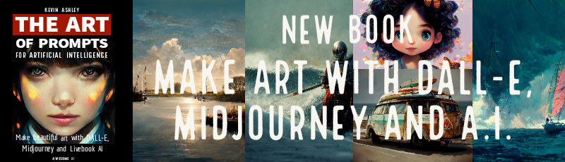
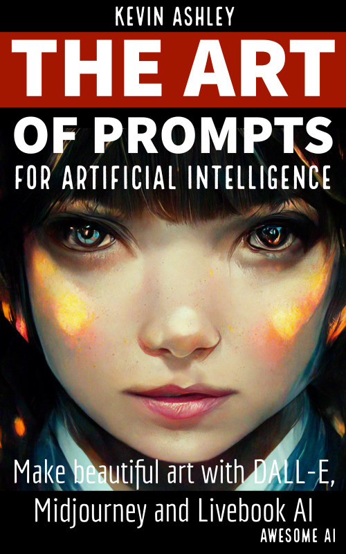
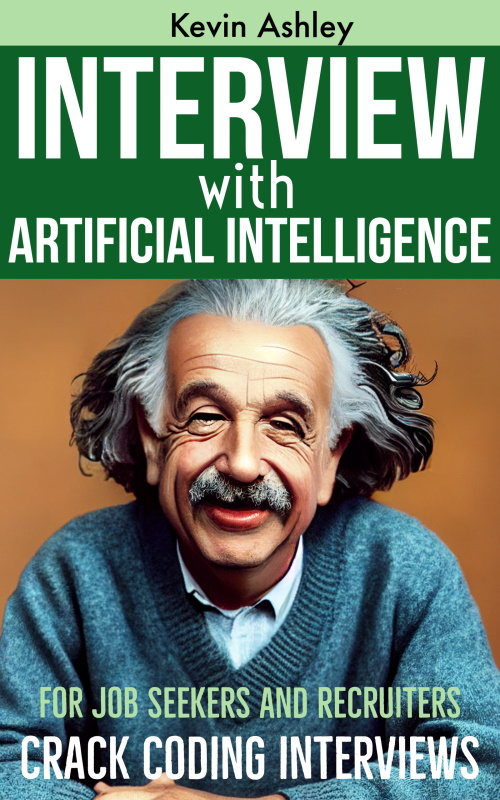
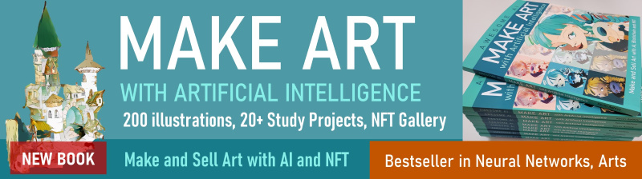
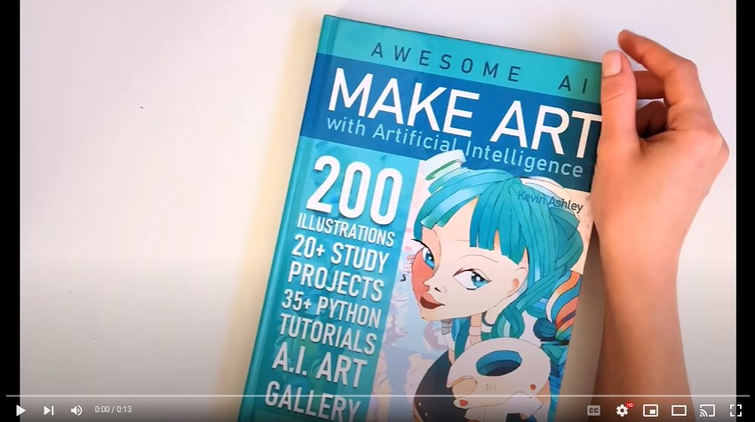
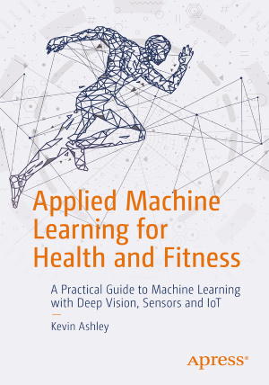
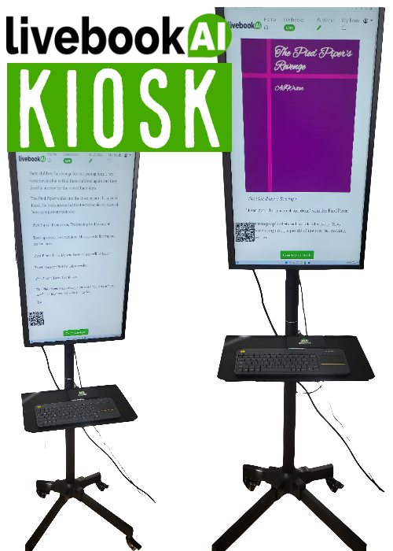

## The Art of Prompts for Artificial Intelligence

_**NEW BOOK! Amazon Bestseller in Neural Networks, Arts**_

The Art of Prompts, is a great resource for anyone interested in digital arts and artificial intelligence. Includes hundreds of illustrations and tips on making beautiful digital art with Midjourney, DALL-E and other artificial intelligence tools. Enjoy browsing through a gallery of hundreds of illustrations made with prompts, try them yourself and have fun!

- [NEW Paperback](https://www.amazon.com/dp/B0BBXQ7VQL), paperback, quality color print, feels and reads like an art book, 200 illustrations 
- [Ebook (Amazon)](https://www.amazon.com/dp/B0BBTRRL15) - reflowable text, easy navigation

Make beautiful art with Midjourney, DALL-E and other artificial intelligence tools.
Includes 200+ beautiful illustrations and tested prompts you can copy-and-paste to jump start creating artwork instantly.
Learn to instantly create professional digital art for your projects, books, documentation, research, or business:

- Illustrations
- Portraits
- Landscapes
- Sketches and Infographics
- Industrial and Architectural Design
- 3D
- Science Fiction
- Fantasy and Games

## Interview with Artificial Intelligence

Announcing the paperback edition of my new book: AI changes the way we learn, get certified, our training and even how we get hired. Enjoy hundreds of puzzles and tests that demonstrate how to apply AI in learning, interviews and more (including the famous "Good Will Hunting" movie problem). Includes practical problems from Google, Amazon, Meta, Microsoft job interviews solved by AI.

- [NEW Paperback](https://www.amazon.com/dp/B0BNV3MN53), paperback 
- [Ebook (Amazon)](https://www.amazon.com/dp/B0BMMB8BZH) - links in text for easy navigation, reflowable

_**Interested in writing a review? [Ping me on LinkedIn](https://www.linkedin.com/in/kashlik/) to get a FREE copy!**_

How to use this book and online tools: this book works best with a subscription to my easy-to-use online artificial intelligence called Ask AI (https://askainow.com), where you can follow with practical exercises, examples, online tests and more. 

Job seekers: can use Ask AI to prepare for job interviews of any complexity! Get valuable coaching, feedback from AI, access training resources and tips to prepare for interviews, practice and get certified by artificial intelligence.

For recruiters, HR and business, the tool provides online tests for candidates with instant artificial intelligence evaluation. Learn about using artificial intelligence in your hiring process, simplify your hiring process and reduce costs for in-person interviews.

## MAKE ART with Artificial Intelligence

_**NEW BOOK: Amazon Bestseller in Neural Networks, Arts**_

>A practical guide for everyone on how to use Artificial Intelligence super-tools in art, illustration, design and more…

- [NEW, Hardcover](https://www.amazon.com/dp/B09LGGST5Y), hardcover, quality color print, feels and reads like an art book, 184 pages, 200 illustrations, 20+ study guides, highlighted tutorial sections, more illustrations than e-book 
- [Paperback](https://www.amazon.com/dp/B091J3T4HM), paperback, quality color print, feels and reads like an art book, 184 pages, 200 illustrations, 20+ study guides, highlighted tutorial sections, more illustrations than e-book 
- [Ebook (Amazon)](https://www.amazon.com/dp/B08YXW7M9K) - reflowable text, easy navigation to tutorials and easy read on phone, tablet or desktop

This book is a richly illustrated tutorial to artificial intelligence (AI) for anyone interested in expanding creativity with AI. Written and illustrated by Kevin Ashley, a Microsoft developer hall of fame engineer, and an author of book and courses on AI, with lots of practical tutorials. Think of this book as v3.0 of your drawing class manual on how to sketch, draw faces, poses, and landscapes, apply light, color, style, emotion, expressions, perspective, generate animations, speech and more with AI.

_**Suggestion: Hardcover and Paperback make a great gift!**_

I noticed that many readers buy the paperback as a gift to college kids, or if they are interested in art and technology. The paperback is a great option: high quality print, color full page illustrations, the book makes a beautiful gift! See fot yourself:

All artwork from this book, made and augmented with AI is available on blockchain as NFT gallery called The Art of AI.

## Applied Machine Learning for Health and Fitness

A book that became classics of A.I. in sports! Used by many sports scientists. For this book you can also check my complete video course [AI in Sports with Python](https://ai-learning.vhx.tv/) with multiple notebooks and tutorials.

## Kevin Ashley Labs

Kevin Ashley engineering labs developed fantastic products that millions of users enjoy. Some of these products are even installed in the museums (for example [AI Kiosk](https://livebookai.com/post/kiosk) for Computer History Museum in Silicon Valley). Kevin Ashley Labs developed all types of products: from artificial intelligence systems like [Ask AI](https://askainow.com), [Livebook AI](https://livebookai.com), to games and fitness and sports apps like Active Fitness and Winter Sports.

## Ask AI

AskAI is a learning, testing and certification platform powered by Artificial Intelligence. It's a new way to learn, prepare for tests, exams and interviews and evaluate your candidates and skills. Because our platform is powered by artificial intelligence, it can answer most top companies interview questions with ease!

## Livebook AI Kiosk

A.I. Digital Signage - Impress your visitors with customized and interactive content created by Artificial Intelligence streaming live to your device! Our Livebook AI Kiosk is a kiosk style tradeshow ready device, the exact replica of our exhibit in the Computer History Museum in Silicon Valley, customized for your content.

It requires a Business subscription to Livebook AI service. The displayed content is customizable for your audience. 

## Active Fitness

Active Fitness is a sport and fitness platform with 2,000,000+ users. If you are interested in Active Fitness development, please [ping me on LinkedIn](https://www.linkedin.com/in/kashlik/).

## Games

If you are interested in games development, please [ping me on LinkedIn](https://www.linkedin.com/in/kashlik/)