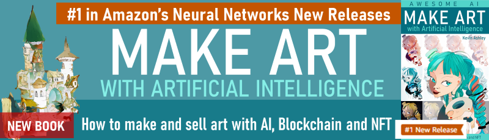

## MAKE ART with Artificial Intelligence
_**Amazon Bestseller in Neural Networks, Arts**_

>A practical guide for everyone on how to use Artificial Intelligence super-tools in art, illustration, design and more…

- [NEW, Hardcover](https://www.amazon.com/dp/B09LGGST5Y), hardcover, quality color print, feels and reads like an art book, 184 pages, 200 illustrations, 20+ study guides, highlighted tutorial sections, more illustrations than e-book 
- [Paperback](https://www.amazon.com/dp/B091J3T4HM), paperback, quality color print, feels and reads like an art book, 184 pages, 200 illustrations, 20+ study guides, highlighted tutorial sections, more illustrations than e-book 
- [Ebook (Amazon)](https://www.amazon.com/dp/B08YXW7M9K) - reflowable text, easy navigation to tutorials and easy read on phone, tablet or desktop

This book is a richly illustrated tutorial to artificial intelligence (AI) for anyone interested in expanding creativity with AI. Written and illustrated by Kevin Ashley, a Microsoft developer hall of fame engineer, and an author of book and courses on AI, with lots of practical tutorials. Think of this book as v3.0 of your drawing class manual on how to sketch, draw faces, poses, and landscapes, apply light, color, style, emotion, expressions, perspective, generate animations, speech and more with AI.

### Suggestion: Hardcover and Paperback make a great gift!

I noticed that many readers buy the paperback as a gift to college kids, or if they are interested in art and technology. The paperback is a great option: high quality print, color full page illustrations, the book makes a beautiful gift! See fot yourself:

All artwork from this book, made and augmented with AI is available on blockchain as NFT gallery called The Art of AI.

## Other Books

### Applied Machine Learning for Health and Fitness

