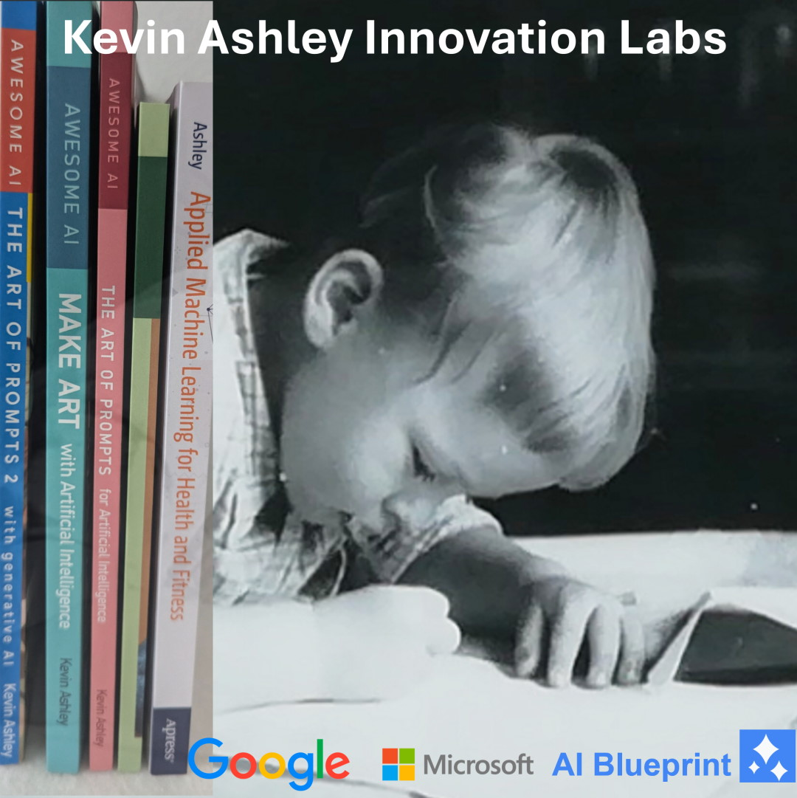
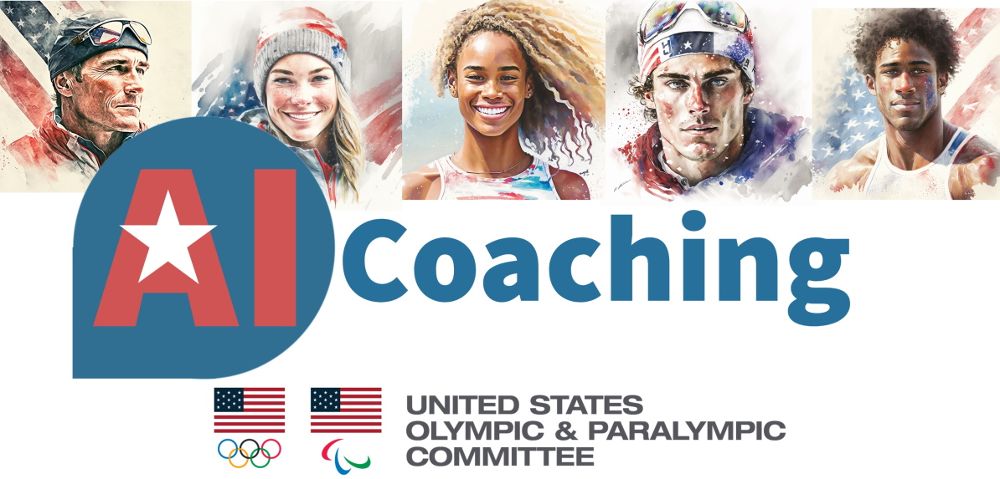
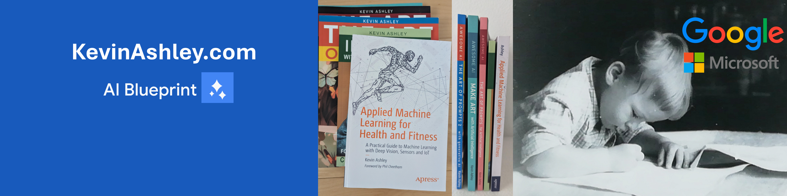

The lab's primary objective is supporting innovation in all aspects of human lives. Founded by Kevin Ashley, [author](/books/books.md), Google Generative AI blackbelt engineer, winner of multiple Microsoft career awards in AI, author of 30+ popular apps with several million users. Founder: [products](/products/products.md) and AI design, [books](/books/books.md).

## What's new in 2024!

- [AI Blueprint](https://www.ai-blueprint.net) - New AI platform for rapid solutions: E-Commerce, Marketing, Finance, Investing, Support
- [AI Coaching](https://aicoaching.us) - AI Coaching wins US Olympic and Paralympic Committee innovation nomination
- [Livebook](https://livebookai.com) - AI E-Commerce - The largest digital products store!
- [Books](http://kevinashley.com/books/books.html) - Check my books

## AI Blueprint

New AI platform to accelerate your AI solutions. If you are thinking of starting an AI solution for your business, consider our blueprint solutions! A blueprint is a prebuilt solution that can be customized by our consulting team or in partnership with your business to the needs of your business. 

[Start with a blueprint: get a complete AI solution!](https://www.ai-blueprint.net)

## AI Coaching

AI Coaching is our joint project with the US Olympic and Paralympic Committee that provides AI Assistants available 24/7 for coaches and athletes to help with everyday training, coaching practice, personal training and more. 

## Livebook

Livebook is an E-Commerce platform and the largest generative AI content management store. 

 

