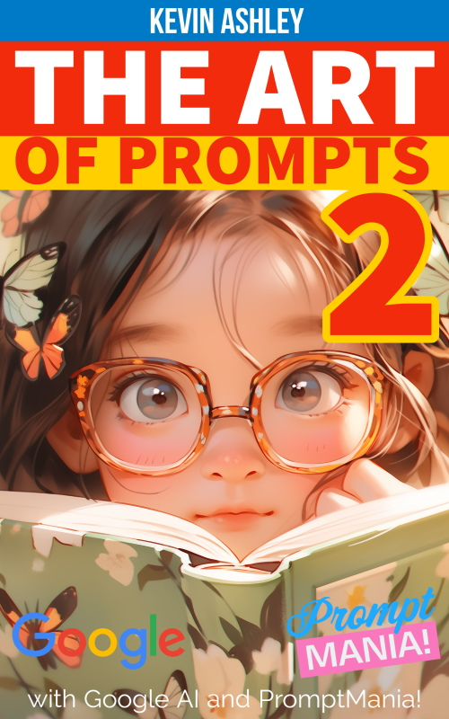

The lab's primary objective is supporting innovation and connection with everyday lives through product design. Founded by Kevin Ashley, [author](/books/books.md), Google Generative AI blackbelt engineer, winner of multiple Microsoft career awards in AI, author of 30+ popular apps with several million users. Founder: [products](/products/products.md) and AI design, [books](/books/books.md).

## What's new in 2024!

- [NEW! Art of Prompts 2](https://www.amazon.com/dp/B0CS6LPJYC) - The  new book in Art of Prompts [Paperback](https://www.amazon.com/dp/B0CS6LPJYC) or  [Ebook on Kindle](https://www.amazon.com/dp/B0CNFM527T) or [Ebook on Google Play](https://play.google.com/store/books/details?id=opjrEAAAQBAJ).
- [Livebook](https://livebookai.com) - Generative AI CMS - Make and share your own generative AI notebooks, greeting cards, stories, illustrations and more!
- [AI Coaching](http://aicoaching.us) - US Olympic and Paralympic Committee app with Generative AI

## NEW! The Art of Prompts 2

_**Available in beautiful paperback and e-book with links!**_

[Paperback](https://www.amazon.com/dp/B0CS6LPJYC) or [Kindle Ebook](https://www.amazon.com/dp/B0CNFM527T) or [Ebook on Google Play](https://play.google.com/store/books/details?id=opjrEAAAQBAJ)

Second book in the series on how to make beautiful art with prompts. 
Includes many new tools discussed in this book: the visual Prompt Maker, Comics Maker, Greeting Card Maker, Story Maker, and tons of templates from [Livebook](https://livebookai.com). You can play with them live and use them to create your own content.

- [NEW Paperback](https://www.amazon.com/dp/B0CS6LPJYC), paperback, quality color print, feels and reads like an art book, 200 illustrations 
- [Ebook (Amazon)](https://www.amazon.com/dp/B0CNFM527T) - reflowable text, easy navigation
- [Ebook (Google Play)](https://play.google.com/store/books/details?id=opjrEAAAQBAJ)

## Livebook

Livebook is a generative AI content management system (CMS) built from the ground up for rich generative AI content - text, illustrations, video, stories, comic books and more. It powers many online businesses and organizations, and is fully customizable to meet the demand for customers interested in using generative AI: from assistance, support, professional articles, documentation, to popular and blog posts, news, stories, fiction, recipes, interesting facts, trivia and more.

 

## AI Coaching

AI Coaching is our joint project with the US Olympic and Paralympic Committee that provides AI Assistants available 24/7 for coaches and athletes to help with everyday training, coaching practice, personal training and more. 

## Kevin Ashley Labs

Kevin Ashley engineering labs developed fantastic products that millions of users enjoy. Some of these products include generative AI content management systems [Livebook](https://livebookai.com), some are even installed in the museums (for example [AI Kiosk](https://livebookai.com/post/kiosk) for Computer History Museum in Silicon Valley), to games and fitness and sports apps like Active Fitness and Winter Sports.

