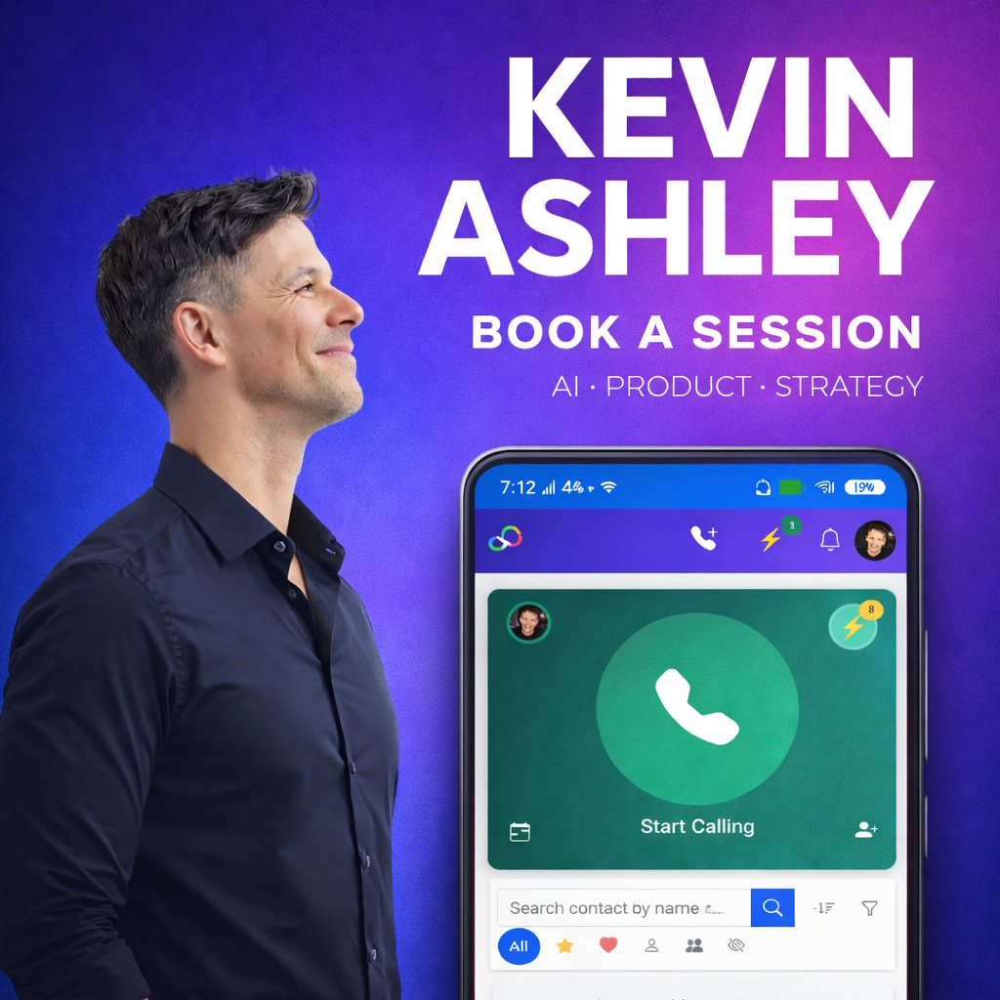

Kevin Ashley is a sought-after speaker, startup founder and enterpreneur at the intersection of AI, product innovation, and real-world execution for the new generation of AI Builders. With a decade long career spanning Microsoft and Google, and as the creator of platforms like AI Coaching, Sportube, Chataranga Messenger, he brings a rare builder’s perspective to every engagement—focused not on theory, but on how to actually ship transformative products for AI, Telecom, Video, Communications, Sports, Edge Hardware and Wearable AI. Kevin works closely with executives, founders, and organizations to identify high-impact AI opportunities, redesign products for the AI era, and accelerate from idea to deployment. As a speaker, he is known for clear, provocative insights on topics like AI-first company design, human + AI collaboration, and the future of global communication—delivered with the credibility of someone who has built systems used at Olympic and global scale.

## Book a session with Kevin

Book a session with Kevin: [Book Now!](https://chataranga.com/calendar/book/kevin.ashley)

### Corporate — AI Consulting for Real Results

Kevin works directly with companies to identify high-impact AI opportunities and turn them into shipped products. From AI-first product design to communication platforms, video systems, and edge hardware, he helps teams move beyond strategy decks into execution. Engagements focus on rapid prototyping, architecture decisions, and building systems that deliver measurable business outcomes.

### Personal — Coaching & Strategic Advice

For founders, builders, and professionals, Kevin offers focused coaching sessions designed to accelerate thinking and decision-making. Whether you're launching a startup, exploring AI opportunities, or navigating product direction, sessions are practical, direct, and tailored to your goals—helping you move faster with clarity.

### Speaker — Conferences & Events

Kevin is an experienced speaker who has presented at events and conferences across Microsoft and Google. His talks cover AI-first company design, human + AI collaboration, and building real products at scale. Submit a request to bring Kevin to your event for sharp, insightful, and actionable sessions.

Book a session with Kevin: [Book Now!](https://chataranga.com/calendar/book/kevin.ashley)

## Highlights

* **AI** — Kevin’s [AI Coaching](https://aicoaching.us) platform powers advanced video analysis for elite athletes, including Team USA and the U.S. Olympic and Paralympic Committee.

* **Agentic AI** — Kevin created *Livebook AI*, one of the world’s longest-running autonomous AI agents, continuously operating at the Computer History Museum in Silicon Valley for over three years—predating modern systems like ChatGPT and large-scale OpenAI deployments.

* **Communications, Video, WebRTC & VOIP** — With [CHATARANGA.COM](https://chataranga.com), Kevin built a global messaging and video platform designed to work where traditional apps fail—connecting over 2 billion people across regions with restricted or unreliable communication infrastructure.

* **Hardware & Physical AI** — Kevin develops intelligent AI-powered camera systems used in sports and security. His California-based team designs and manufactures custom hardware deeply integrated with real-time AI analytics and video processing.

* **Books & Education** — Kevin is the author of *[Applied Machine Learning for Health and Fitness](https://link.springer.com/book/10.1007/978-1-4842-5772-2)* and created the online course *[AI in Sports with Python](https://ai-learning.vhx.tv/)*, helping engineers and practitioners apply AI to real-world sports and performance problems.

