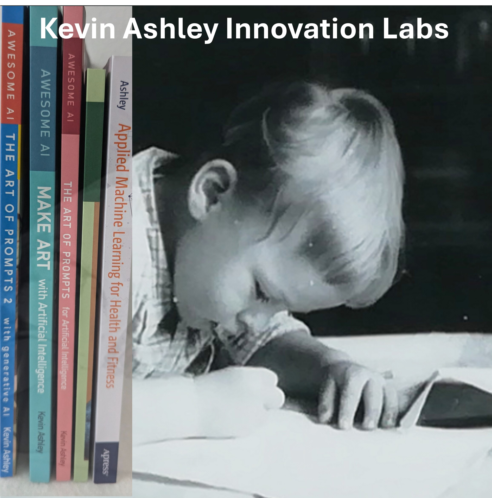
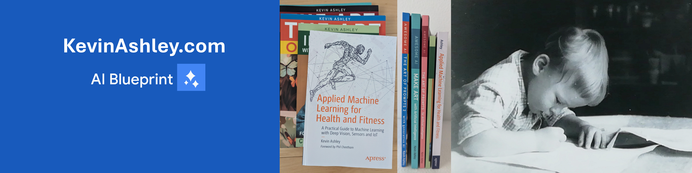

The lab's primary objective is supporting research and innovation in all aspects of human lives. Founded by Kevin Ashley, [author](/books/books.md), Google Generative AI blackbelt engineer, winner of multiple Microsoft career awards in AI, author of 30+ popular apps with several million users. Founder and author: [books](/books/books.md).

## What's new in 2025!

- [AI Coaching](https://aicoaching.us) - AI Coaching wins US Olympic and Paralympic Committee innovation award and continue helping Team USA
- [Sportube](https://sportubeai.com) - Turn any YouTube video into AI Coach - providing coaching experience for 5 billion videos on YouTube 
- [Agentomat](https://agentomat.com) - Agents as a Service (AaaS) platform for business.
- [Books](http://kevinashley.com/books/books.html) - Check my books

## AI Coaching

AI Coaching is our joint research project with the US Olympic and Paralympic Committee that provides AI Assistants available 24/7 for coaches and athletes to help with everyday training, coaching practice, personal training and more to Team USA. 

## Sportube

Turn any video into AI Coach! Great tool for YouTube sport videos!

## Agentomat

Agentomat is our business AI tool, Agents as a Service. Best business tools for AI Agents: create, share, monitor Agents for your business.

[AGENTOMAT.COM](https://agentomat.com)

