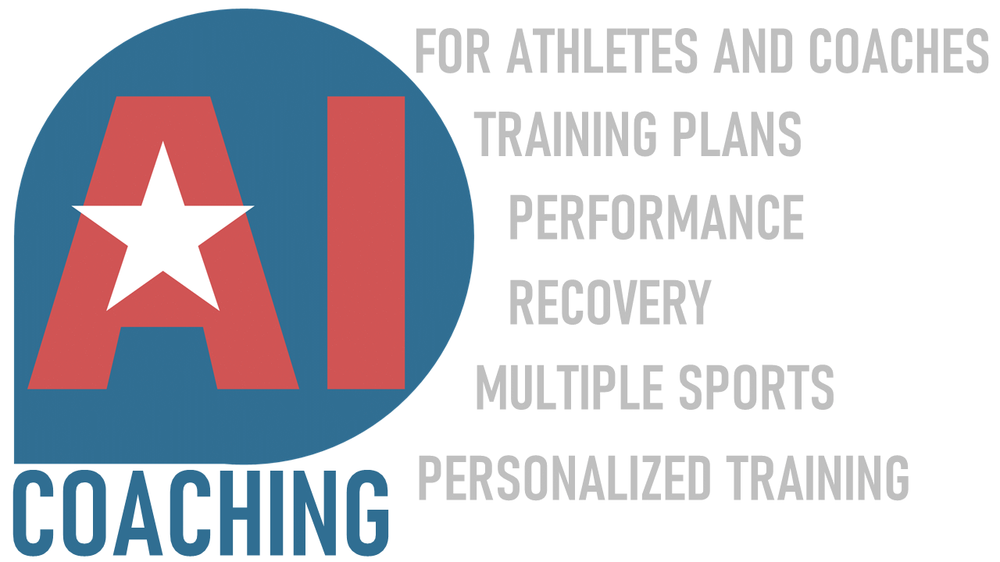
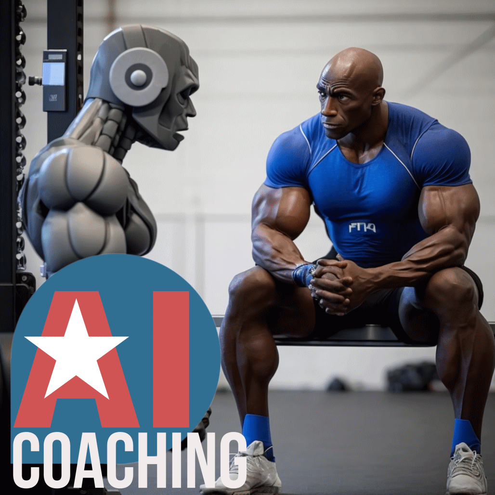

# AI Coaching

**Coming Soon! Check [AICoaching.US](http://aicoaching.us)**

AI Coaching will provide a new AI enhanced user experience for coaches and athletes, leveraging generative AI large language models (LLMs) as well as more advanced multi-modal AI models, to provide analysis and guidance to coaches and athletes seeking support, guidance, and personalized training expertise in sports. AI Coaching will enable sports coaches and athletes to integrate AI into everyday coaching practice integrating both human and AI coaching experience, helping users get the information faster, and in a more personalized manner. It’ll also help with some of the routine and ideation tasks, providing initial drafts for training plans and other coaching scenarios.

