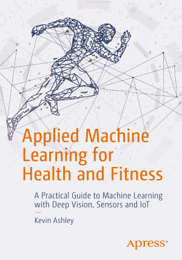

# Books

## Applied Machine Learning for Health and Fitness

A book that became classics of AI/ML in sports and is now a part of Stanford, MIT and Florida Tech curricula! Used by many sports scientists. For this book you can also check my complete video course [AI in Sports with Python](https://ai-learning.vhx.tv/) with multiple notebooks and tutorials.

## AI in Sports with Python

Course: [AI in Sports with Python](https://ai-learning.vhx.tv/) with multiple notebooks and tutorials.
