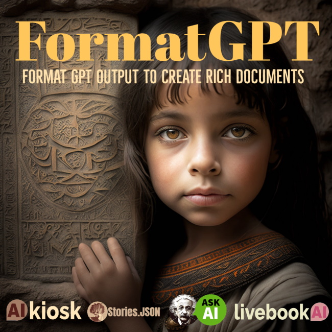

# FormatGPT

Coming Soon! Check [FormatGPT.com](http://formatgpt.com) for updates.

Announcing FormatGPT, the engine and API used in [Ask AI](https://askainow.com), [Livebook AI](https://livebookai.com/category), and [AI Kiosks](https://livebookai.com/post/kiosk) to create formatted output from GPT models developed by Kevin Ashley Labs. Based on an industry standard [Stories.JSON](https://github.com/kevinash/Stories.JSON) format specification for FormatGPT. 

Check [sample](https://livebookai.com/post/7q9epv66j7vd4zma) documents created with FormatGPT.

FormatGPT features:

- Create editable rich beautiful documents from multiple GPT models
- Schedule and run GPT model jobs
- Quality control for GPT model output
- Validation and verification of GPT output
- Compose multiple AI models in beautiful documents
- Insert advertising and custom content in GPT output
- Provides a powerful workflow engine for GPT tasks

## Showcases

Stories.JSON is used in the following projects:

 - [Ask AI](https://askainow.com) - AI Training and Learning Platform

 - [Livebook AI](https://livebookai.com/category) - AI Stories Platform

 - [AI Kiosk](https://livebookai.com/post/kiosk) at the Computer History Museum

## Availability

If you are interested in FormatGPT, please contact [Kevin Ashley](https://www.linkedin.com/in/kashlik/) on LinkedIn. The engine is available for commercial licensing.
