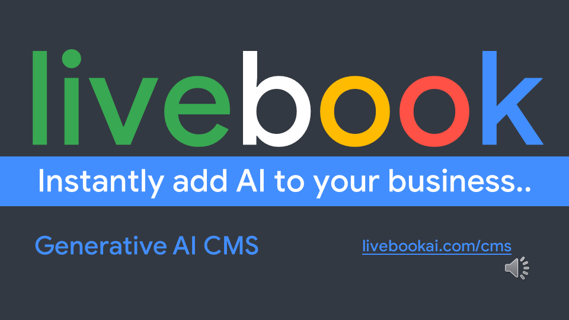
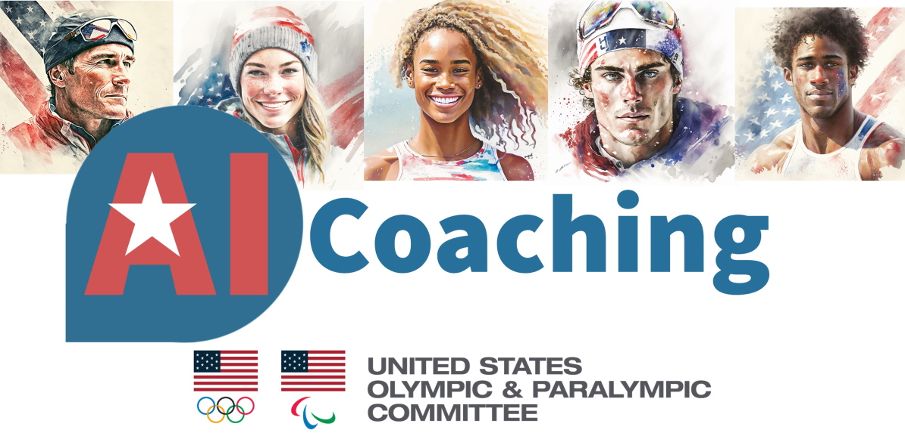
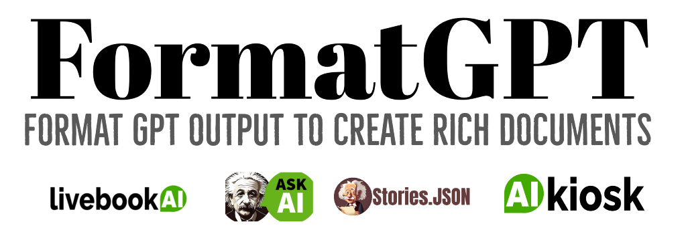

# Products

Kevin Ashley Labs developed products enjoyed by millions of users. Some are even installed in the museums (for example [AI Kiosk](https://livebookai.com/post/kiosk) for Computer History Museum in Silicon Valley). 

## Livebook 

Livebook is a generative AI content management system (CMS) built from the ground up for rich generative AI content - text, illustrations, video, stories, comic books and more. It powers many online businesses and organizations, and is fully customizable to meet the demand for customers interested in using generative AI: from assistance, support, professional articles, documentation, to popular and blog posts, news, stories, fiction, recipes, interesting facts, trivia and more.

 

## AI Coaching

The AI innovation project for US Olympic and Paralympic Committee to help athletes and coaches with training.

## Livebook AI Kiosk

A.I. Digital Signage - Impress your visitors with customized and interactive content created by Artificial Intelligence streaming live to your device! Our Livebook AI Kiosk is a kiosk style tradeshow ready device, the exact replica of our exhibit in the Computer History Museum in Silicon Valley, customized for your content.

It requires a Business subscription to Livebook AI service. The displayed content is customizable for your audience. 

## Ask AI

AskAI is a learning, testing and certification platform powered by Artificial Intelligence. It's a new way to learn, prepare for tests, exams and interviews and evaluate your candidates and skills. Because our platform is powered by artificial intelligence, it can answer most top companies interview questions with ease!

 

## FormatGPT

Now US PATENT PENDING [Interested in this patent or want to license? Book time on my calendar](https://calendly.com/askainow)

Make rich documents from GPT models.

[FormatGPT](http://FormatGPT.com) is a rich productivity platform for Business, providing an API to generate your documents.

## Stories.JSON

[Stories.JSON](https://github.com/kevinash/Stories.JSON) is an open source format created by [Kevin Ashley Labs](http://kevinashley.com) for composing large language models such as GPT, ChatGPT, Codex, Stable Diffusion etc. This format is used by [Ask AI](https://askainow.com), [Livebook AI](https://livebookai.com) and many other applications for prompt composition.

If you are interested in a Python library for automating Stories.JSON and the composition engine, please contact [Kevin Ashley](https://www.linkedin.com/in/kashlik/).

Link to [Stories.JSON](https://github.com/kevinash/Stories.JSON) open source format.

## Active Fitness

Active Fitness is a sport and fitness platform with 2,000,000+ users. If you are interested in Active Fitness development, please [ping me on LinkedIn](https://www.linkedin.com/in/kashlik/).

## Games

If you are interested in games development, please [ping me on LinkedIn](https://www.linkedin.com/in/kashlik/)
