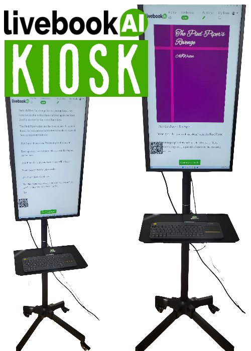
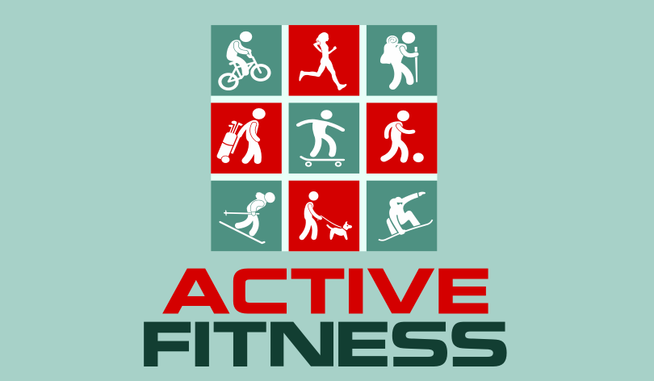

# Products

Kevin Ashley Labs developed products enjoyed by millions of users. Some are even installed in the museums (for example [AI Kiosk](https://livebookai.com/post/kiosk) for Computer History Museum in Silicon Valley). 

## Ask AI

AskAI is a learning, testing and certification platform powered by Artificial Intelligence. It's a new way to learn, prepare for tests, exams and interviews and evaluate your candidates and skills. Because our platform is powered by artificial intelligence, it can answer most top companies interview questions with ease!

 

## Livebook AI Kiosk

A.I. Digital Signage - Impress your visitors with customized and interactive content created by Artificial Intelligence streaming live to your device! Our Livebook AI Kiosk is a kiosk style tradeshow ready device, the exact replica of our exhibit in the Computer History Museum in Silicon Valley, customized for your content.

It requires a Business subscription to Livebook AI service. The displayed content is customizable for your audience. 

## Active Fitness

Active Fitness is a sport and fitness platform with 2,000,000+ users. If you are interested in Active Fitness development, please [ping me on LinkedIn](https://www.linkedin.com/in/kashlik/).

## Games

If you are interested in games development, please [ping me on LinkedIn](https://www.linkedin.com/in/kashlik/)