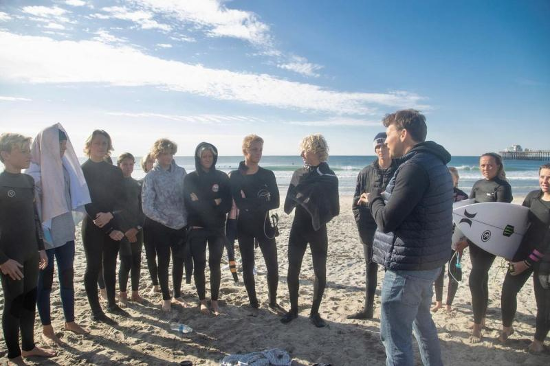
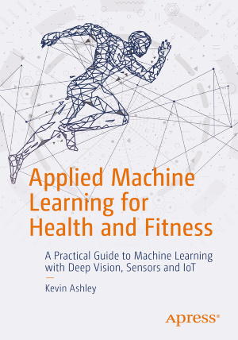

# Surfing Science Camp

Join us for 2 days in the surfing paradise of sunny California, for a surfing science camp, coming Summer 2023.

[Sign Up](https://docs.google.com/forms/d/e/1FAIpQLScXdsfbKFUxMy-CIIvuNawVKA0dfEwl-9Xtrhyn2IlRk5VQDg/viewform?usp=sf_link). 

This camp is for anyone who wants to learn to surf (any level beginner - intermediate - advanced) and apply technology, data science and artificial intelligence. It is perfect for data scientists passionate about sports and surfing.

Each participant will get video analysis with AI and Kevin Ashley's [book](https://www.amazon.com/gp/product/B08GLG5CFG) that became classics of A.I. in sports, used by many sports scientists, you'll also get access to data science  [video course](https://ai-learning.vhx.tv/). 

## Where

California, Orange County, surfing paradise. Near San Clamente, and Trestles (world known location for world level surf competitions). Exact location TBD.

## When

Summer, 2023 (between June and August)

## Schedule

- Day 1 
    - Morning 
        - Stretching and getting ready
        - Surfing and instruction
    - Noon 
        - Lunch break
    - Afternoon
        - Analysis (Video, AI)
- Day 2
    - Morning 
        - Stretching and getting ready
        - Surfing and instruction
    - Noon 
        - Lunch break
    - Afternoon
        - Analysis (Video, AI)

## Pricing

The cost of the camp is $1,500 for the camp, trainign materials, coaching, video and AI analysis. Please, reserve your own lodging: town of San Clemente has plenty of great lodging available. After you [sign up](https://docs.google.com/forms/d/e/1FAIpQLScXdsfbKFUxMy-CIIvuNawVKA0dfEwl-9Xtrhyn2IlRk5VQDg/viewform?usp=sf_link) for the camp, please [submit your payment](https://buy.stripe.com/3csaGk4Qk2byfqo7sw). Payment must be made before we start the camp. Group pricing is available, please contact us at info@livebookai.com.

## Materials

- Book

- Video
- Artificial Intelligence (AI) analysis

[Sign Up](https://docs.google.com/forms/d/e/1FAIpQLScXdsfbKFUxMy-CIIvuNawVKA0dfEwl-9Xtrhyn2IlRk5VQDg/viewform?usp=sf_link). 